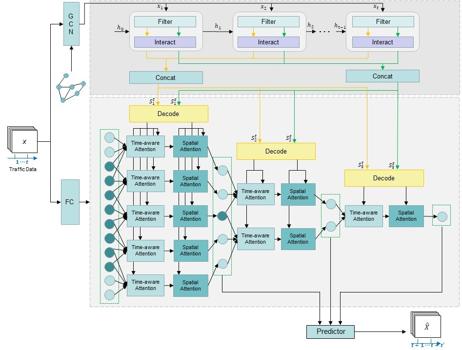

# ASTDIN
This is the code of paper: Attention Based Spatial-Temporal Dynamic Interact Network for Traffic Flow Forecasting

---

# Requirements

matplotlib

numpy

scipy

pandas

torch

argparse

---

# Results

